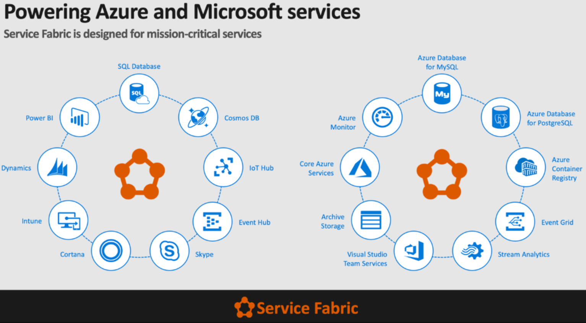
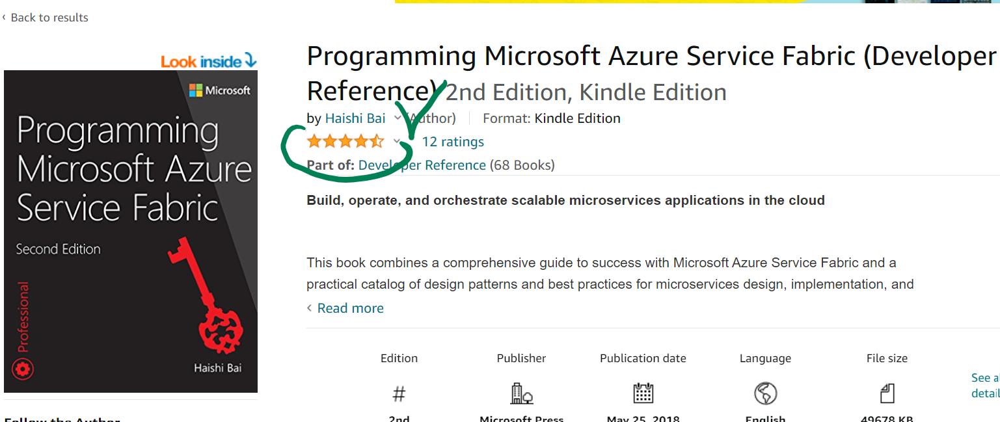
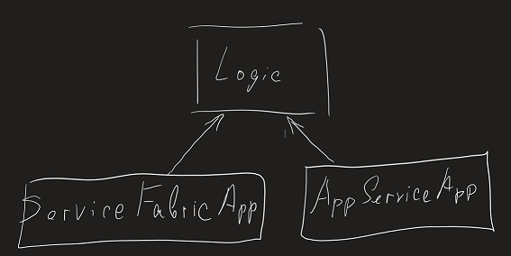

# From Service Fabric to App Service
Service Fabric is very powerful PaaS that is ground for many fundamental services in Azure and beyond. However there are issues in its maintenance and general development experience. To be more production I was working PaaS migration from Service Fabric to App Service. This document contains retrospective of challenges that I had on this way.
- [From Service Fabric to App Service](#from-service-fabric-to-app-service)
  - [Why to go from Service Fabric](#why-to-go-from-service-fabric)
    - [My Service Fabric larning path](#my-service-fabric-larning-path)
    - [Service Fabric issues](#service-fabric-issues)
  - [Where to go from Service Fabric](#where-to-go-from-service-fabric)
  - [How to go from Service Fabric](#how-to-go-from-service-fabric)
  - [Service Fabric agnostics - Dependency Injection](#service-fabric-agnostics---dependency-injection)
  - [Geneva Monitoring agent on AppService/Antares](#geneva-monitoring-agent-on-appserviceantares)
  - [Certificates on AppService](#certificates-on-appservice)
    - ["Microsoft.Web/certificates" resource](#microsoftwebcertificates-resource)
    - [Construct new X509Certificate2 from imported byte array](#construct-new-x509certificate2-from-imported-byte-array)
    - [Certificate ephemeral key sets](#certificate-ephemeral-key-sets)
  - [Custom headers WS-Federation](#custom-headers-ws-federation)
  - [SNAT ports limit](#snat-ports-limit)
- [THE END - No it is just the beginning. Next stop is Containers :)](#the-end---no-it-is-just-the-beginning-next-stop-is-containers-)

## Why to go from Service Fabric
From Service Fabric documentation:
> Azure Service Fabric is a distributed systems platform that makes it easy to package, deploy, and manage scalable and reliable microservices and containers. Service Fabric also addresses the significant challenges in developing and managing cloud native applications.

    
### My Service Fabric larning path
1. [Azure Service Fabric for Developer.  Jeffrey Richter on //BUILD/ ](https://channel9.msdn.com/events/Build/2016/B874?term=jeffrey%20richter%20service%20fabric%20course&lang-en=true)
2. Jeffrey Richter had video training series of Service Fabric.
3. Service Fabric book 

The book is available on [learning.oreilly.com](https://learning.oreilly.com/library/view/programming-microsoft-azure/9781509307135/). The book is MSFTE for free. It is 500 pages long. 
Cover lots of topics deeply:
   * Ring structure and distributed consensus
   * Scaling
   * Containers - the "Future of Service Fabric".
4. [Inside Azure Service Fabric - video series](https://www.youtube.com/watch?v=oIdkbdlnmbw&list=PLlrxD0HtieHh73JryJJ-GWcUtrqpcg2Pb) Service Fabric PMs meet different customers. Highly recommend to watch specially [Cesar Ruiz-Meraz: Azure Event Hubs](https://www.youtube.com/watch?v=OxXGnbHAXB0&list=PLlrxD0HtieHh73JryJJ-GWcUtrqpcg2Pb&index=3). After watching ask yourself as architect: How would you as an Architect design EventGrid/ApatchKafka cluster without Service Fabric?

### Service Fabric issues
  1.  General infrastructure Complexity - read at least half of the book before making decision to use it.
  2.  Stateful services maintenance - I have not found it in the book but found it in one of conference videos. Service Fabric Stateful Service is literally database engine running on Service Fabric nodes. Service Fabric generates replicatable transaction log which must be trancatenated. To understand how database transaction logs are implemented read [SQL Server Internals](https://www.amazon.com/Microsoft%C2%AE-Server%C2%AE-Internals-Developer-Reference/dp/0735626243/ref=sr_1_5?dchild=1&keywords=sql+server+internals+book&qid=1624974027&sr=8-5) book. 
  3.  Service Fabric Application Model - Service Fabric coupling that doesn't allow to run on other platforms
        * Marker interfaces. Problem for dependency Injection and violation of [.NET Framework Design Guidelines](https://www.amazon.com/Framework-Design-Guidelines-Conventions-Libraries/dp/0321246756/ref=sr_1_2?dchild=1&keywords=framework+design+guidelines&qid=1624980035&sr=8-2)  
        * Remouting - coupling to network communication. Better to use HTTP service discovery.
        * Service Fabric Mesh never become mature - Kubernates wins.
  4. Service Fabric SDK
       * SDK didn't work for weeks and I waited for pathes.
       * SDK updates installation was enforced and there were no way to escape.
       * SDK frizzes and PC restart is required few times a day.
       * Application Model doesn't allow to run without SDK.
  5. Conclusion: 
      * Service Fabric is for super highly scaled Stateful Services.
      * Service Fabric features are necessary in up to 5% of design cases. 
      * SDK development expirience is not good.
## Where to go from Service Fabric
  1. Kubernates is the trend but noone had enough of Containers expirience in our team. We lots of small issues even  without containers and Kubernates.
  2. App service is the simplest PaaS in Azure and the shortest path to migrate (how I was thinking).
  There are few options for hosting in App Service:
     1. Windows IIS. The oldest and the most basic option on App Service is to use ASP.NET Core Razor.
     2. Linux Azure Function without container with .NET Core. 
     3. Windows Contaiter - HyperV - disapointing feature because Server 2019 supports container process isolation but such new feature was not used on AppService.
     4. Linux Container - Process isolation - the most light weight container and the most compatible with Kubernates.
## How to go from Service Fabric
  1. Comon logic extraction. 
  Move maximum of common logic into .NET Standard assemblies and reference it from two Applications (Service Fabric and AppService.)
  
  2. Dependency Injection
  Injection of Service Fabric dependencies in ASP.NET Core 2+ allows to use sinle application entry point to start with different dependencies configuration depending on detection of Service Fabric environment.

## Service Fabric agnostics - Dependency Injection  
1. Read Dependency Injection book and refactor to Dependency Injection
"Dependency Injection Principles, Practices, and Patterns" book is the ultimate source of learning about Dependnecy Injection on .NET 
Mark Seeman is ex-Microsoft architect and now he is cofounder of consulting company. He has [very respected blog](https://blog.ploeh.dk/2017/02/02/dependency-rejection/) about architecture, dependency injection and functional programming.
\


2. Refactor solution logic that can be refactored to dependency injection.
2. Detect Service Fabric from Program.cs
```csharp
// Program.cs
// void Main(string[] args)

if (!string.IsNullOrWhiteSpace(Environment.GetEnvironmentVariable("Fabric_ApplicationId")))
{
 // Service Fabric AppModel activation
 ServiceRuntime.RegisterServiceAsync(
     "WebFrontendType",
     context => new WebFrontend(context)
 ).GetAwaiter().GetResult();

 // Prevents this host process from terminating so services keeps running.
 // Looks like Service Fabric process wants to live forever :)
 Thread.Sleep(Timeout.Infinite);
}
else
{
 var appSettings = new AppSettings(new AppSettingsKeyValueSourceFromEnvironmentVariables());
 void AddServices(IServiceCollection services)
 {
     // Configure dependency injection composition before Startup will be called.
     services.AddSingleton<AppSettings>(appSettings);
     services.AddSingleton<IApplicationVersionContext, ExecutableApplicationVersionContext>();
     ...
 }

 var webHostBuilder = WebHost
     .CreateDefaultBuilder<Startup>(args)
     .UseKestrel()
     .ConfigureServices(AddServices);
 webHostBuilder.Build().Run();
}
```
3. Clean up ASP.NET Core Startup.cs 
  * Startup must be ServiceFabric agnostic.
  * Startup may contain only services that will work with both Service Fabric and Self hosted applicaiton.
  * Use [Options pattern in ASP.NET Core](https://docs.microsoft.com/en-us/aspnet/core/fundamentals/configuration/options?view=aspnetcore-5.0). Options pattern allows to avoid options hardcoding and init options using Dependency Injection
  ```csharp
  public sealed class ConfigureHttpsRedirectionOptions : IConfigureOptions<HttpsRedirectionOptions>
  {
      private readonly Domain.CommonConfiguration.IAppSettings appSettings;

      // Dependency injection of settings that may come either from Service Fabric Configuration or from Self Hosted app Environment Variabled.
      public ConfigureHttpsRedirectionOptions(Domain.CommonConfiguration.IAppSettings appSettings)
      {
          this.appSettings = appSettings;
      }

      public void Configure(HttpsRedirectionOptions options)
      {
          // Initialize Options object.
          options.RedirectStatusCode = StatusCodes.Status307TemporaryRedirect;
          options.HttpsPort = appSettings.FrontendPortalHostPortHttps;
      }
  }
  ```
  
## Geneva Monitoring agent on AppService/Antares
Geneva Monitoring Agents run in First Party subscriptions as AppService extension. Read Geneva Docs to [Setting Up an Azure App Service to Collect Logs and Metrics](https://eng.ms/docs/products/geneva/getting_started/environments/azurewebapp).

## Certificates on AppService
There are few ways to work with certificates on AppService:
1. "Microsoft.Web/certificates" resource.
2. Construct new X509Certificate2 from imported byte array.
3. Certificate ephemeral key sets.

### "Microsoft.Web/certificates" resource
Certificate may be imported from KeyVault to AppServiceFarm and loaded using User CertificateStorage. By default IIS hosted WebSite runs without user Profile. SSL/TLS and AAD authentication certificates may be imported to AppServiceFarm using ARM template. Certificate is kind of hidden resource type. To see it you should check "Show hidden types" checkbox in Azure portal resource group blade. "Microsoft.Web/certificates"
``` json
{
      "type": "Microsoft.Web/certificates",
      "apiVersion": "2018-11-01",
      "name": "[variables('customHostNameCertificateName')]",
      "location": "[resourceGroup().location]",
      "properties": {
        "KeyVaultId": "[resourceId('Microsoft.KeyVault/vaults', parameters('keyVaultNameRegional'))]",
        "KeyVaultSecretName": "[parameters('keyVaultSecretName')]",
        "password": "",
        "serverFarmId": "[concat(resourceGroup().id, '/providers/Microsoft.Web/serverfarms/', parameters('serverFarmName'))]"
      },
      "dependsOn": []
    },
```
Imported certificate may be associated with App Service custom domain with ARM "Microsoft.Web/sites/hostNameBindings" resource or using Azure Portal. Imported certificate is daily autorotated. 
Certificate may be read by application from User certificate store after settings WebSite configurations:
``` json
{
  "name": "WEBSITE_LOAD_CERTIFICATES",
  "value": "*"
},
{
  "name": "WEBSITE_DELAY_CERT_DELETION",
  "value": "1"
},
```
"WEBSITE_LOAD_CERTIFICATES" activates user profile and allows application to read certificates from Certificate User store. 
By default during autorotation new versions of certificate is installed on AppService and old version of certificate is removed immediately. It may cause problem for application that already started and loaded certificate with private key from User Store. Certificate rotation will remove old certificate private key from the disk and will cause a cryptographic faulure. To avoid such an issue use new "WEBSITE_DELAY_CERT_DELETION" setting that tracks used certificates during application process lifecycle and delays their deletion untill process will be restarted on WebSite restart or redeploy.
Installed certificate can be used for cryptography.
``` fsharp
let readCertificateBySubject(subject: string) =
    use store = new X509Store(StoreName.My, StoreLocation.CurrentUser)
    store.Open(OpenFlags.ReadOnly);
    let col = store.Certificates.Find(X509FindType.FindBySubjectName, subject, false)
```
For C# sample see [Load certificate in Windows apps](https://docs.microsoft.com/en-us/azure/app-service/configure-ssl-certificate-in-code#load-certificate-in-windows-apps)
For container cases see [Load certificate in Linux/Windows containers](https://docs.microsoft.com/en-us/azure/app-service/configure-ssl-certificate-in-code#load-certificate-in-linuxwindows-containers)
\
Aur service used some old .NET Framework libraries that were designed 15 years ago before Azure appeared using .NET 3 Windows Identification Foundation.
1. Certificates 
 1. DSTS cert
 2. SSL cert
 3. AAD service identity client cert
   1. In memory certificate 
   2. Installed certificate
4.3 - Custom headers WS-Federation
4.4 - One Cert
4.5 - SNAT ports
### Construct new X509Certificate2 from imported byte array
By default IIS hosted WebSite runs without user Profile and certificate may be constructed from byte array with MachineKeySet. 
``` fsharp
new X509Certificate2(Convert.FromBase64String secret, "", X509KeyStorageFlags.MachineKeySet)
```
Such approach is not the best choice by few reasons:
   1. App Service has limit to allow create about 60 certificates with MachineKeySet. Each X509Certificate2 constructor call persists private key on the disk and limit will be reached.
   2. X509Certificate2 with MachineKeySet must have singleton lifecycle. X509Certificate2 object Despose/Finalization will remove private key. If two X509Certificate2 will be constructed and linked to the same private key then disposing first one will break the second one with causing CryptographicException inability to use private key in Cryptographic API.

That's why to create X509Certificate2 it is better to use user profile:
    1. Set WEBSITE_LOAD_CERTIFICATES
    2. Create X509Certificate2 in user profile with PersistKeySet. PersistKeySet means that certificate key is phisically stored on the disk but will not be removed after X509Certificate2 object Disposal/Finalization.
``` fsharp
new X509Certificate2(Convert.FromBase64String secret, "", X509KeyStorageFlags.UserKeySet ||| X509KeyStorageFlags.PersistKeySet)
```
### Certificate ephemeral key sets
Construction X509Certificate2 from byte array and store it only in process memory is simple option but `X509KeyStorageFlags.EphemeralKeySet` is supported only in .NET Framework or .NET 5. Also EphemeralKeySet is not supported on MacOS.
## Custom headers WS-Federation
We used WS-Federation authentication. AppService has header size limit to avoid DOS attacks. To avoid header overload we store user groups claims in session. `WsFederationOptions.Events.OnTicketReceived` allows to customize `ClaimsIdentity`.
## SNAT ports limit
Read [Azure AppService HttpClientFactory - use cached but fresh http message handlers](./../AppServiceHttpClientFactory/Readme.md)
# THE END - No it is just the beginning. Next stop is Containers :)